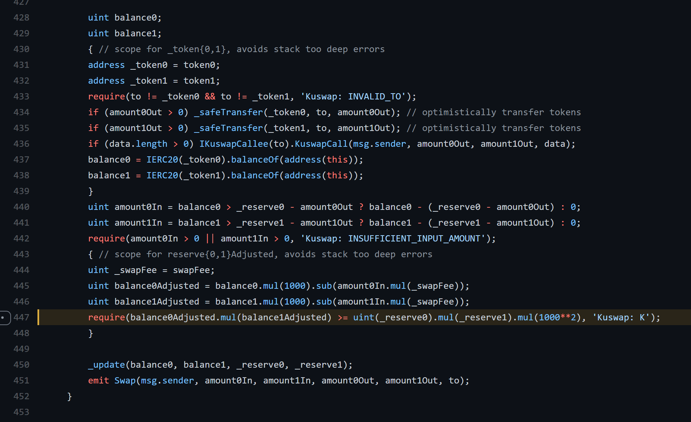

# 🔐 Insurance Fund for Users

**Kuswap KuVault** is an emergency insurance fund for all our users. 1% of all outstanding tokens will be allocated to a specific wallet to protect all our users and their funds in case of an emergency. All the funds will be stored in a separate wallet.

## **Protection against flash loan attacks:**

When it comes to our code, the attacker cannot do reentrance and perform a second swap before reserves, which are used to calculate the number of tokens in swaps, and updated. This is ensured by the following line in the code:

## Join us  

💬 **TG Chat:** [https://t.me/kuswapfinance](https://t.me/kuswapfinance) 

📣 **News Channel**: [https://t.me/kuswapannouncements](https://t.me/kuswapannouncements) 

🕊️ **Twitter**: [https://twitter.com/kuswapfinance](https://twitter.com/kuswapfinance) 

📜 **Medium**: [https://kuswap.medium.com/](https://kuswap.medium.com/)

